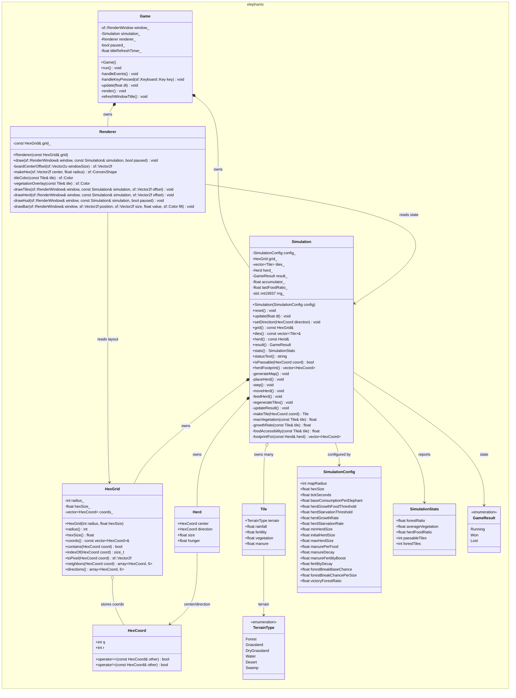

# Диаграмма классов

Эта схема показывает основные типы кодовой базы и зависимости между игровым циклом, симуляцией, гекс-сеткой и рендером.

## Как читать схему

- `Game` - runtime-обвязка: окно, ввод, кадры, пауза и рестарт.
- `Simulation` - единственный владелец игрового состояния и правил экологии.
- `HexGrid` - геометрия axial-гексов, соседи и перевод координат в пиксели.
- `Renderer` - read-only слой отрисовки, который читает `Simulation` и не меняет модель.
- `Tile`, `Herd`, `SimulationConfig` и `SimulationStats` - простые структуры данных для состояния и баланса.

Стрелки `owns` означают владение объектом по значению. Стрелки `reads` означают зависимость без владения: например, `Renderer` хранит ссылку на `HexGrid` и получает `Simulation` только на время `draw()`.